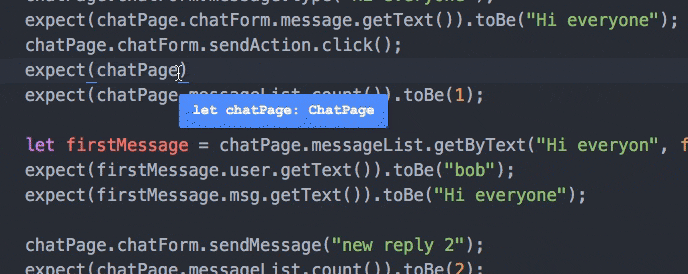

# Xenon Framework
A Typesafe page object framework, suitable for e2e testing Angular/React apps

[](https://gitter.im/ten-eleven/xenon?utm_source=badge&utm_medium=badge&utm_campaign=pr-badge&utm_content=badge)

[Full API Documentation](https://joemcelroy.gitbooks.io/xenon/content/)



Xenon is a JavaScript Testing utility for protractor that makes it easier to manage E2E testing with applications which heavily use components. Xenon's API helps you create testing objects which mirror your components structure.

Xenon is written in typescript and any components you write in typescript can be benefit from code completion and showing compile errors when components change over time. Xenon also has a powerful list generics which allow you to write a page object for a single row/element and apply to multiple instances of that element like those commonly found in list + table UI's.

Xenon helps by reducing the amount of duplicated code within E2Es and means that if the UI changes, the fix need only to be applied to one place. Xenon components can be shipped and versioned with your component making it easy for others to use and rely on in their E2E tests.

If you find difficulty maintaining your e2e tests when making simple changes to your component, Xenon may help.

Can be thought of as a page object framework. See [page object design pattern](http://martinfowler.com/bliki/PageObject.html).

## Why protractor?

Protractor is an end to end test framework for AngularJS applications and maintained by the angular team. It has great community backing and support from Google. The community also uses it for React applications and we have written E2E's for React apps ( [Searchkit E2E](https://github.com/searchkit/searchkit/blob/master/test/e2e/specs/TestSpec.ts) ) with xenon and protractor.  

## Why typescript?
Typescript is a typed superset of JavaScript. If you're xenon objects change, typescript will highlight any issues these changes have made. Code completion makes working with large component trees easy.

## Installation
To get started with xenon, you can simply install it with npm:

```sh
npm install --save-dev xenon
```

We rely on `protractor 3.0^`.

## Example Usage

```typescript
import {Component, List, defaults, field} from "xenon";


@defaults({qa:"chat-form"})
class ChatForm extends Component {

  @field(Component, {qa:"message"})
  message: Component;

  @field(Component, {css:"#sendMessage"})
  sendAction: Component;

  @field(Component, {css:"#missingAction"})
  missingAction: Component;

  sendMessage(message:string):void {
    this.message.type(message);
    this.sendAction.click();
  }

}

@defaults({qa:"user-form"})
class UserForm extends Component {

  @field(Component, {qa:"username"})
  username: Component;

  @field(Component, {qa:"send-action"})
  sendAction: Component;

  login(name:string) {
    this.username.type(name);
    this.sendAction.click();
  }

}

@defaults({states:Message.states})
class Message extends Component {

  public static states = {
    LATEST: "latest"
  }

  @field(Component, {qa:"message--msg"})
  msg:Component;

  @field(Component, {qa:"message--user"})
  user:Component;

}

class ChatPage extends Component {

  @field(Component, {qa:"options--select"})
  menu: Component;

  @field(ChatForm)
  chatForm: ChatForm;

  @field(UserForm)
  userForm: UserForm;

  @field(Component, {css:"h4"})
  title: Component;

  @field(List, { qa:"messages", itemQA:"message", itemType:Message })
  messageList: List<Message>;

}

describe("Chat App features", () => {
  it("general acceptance", () => {
    browser.get("http://localhost:3002")
    let chatPage:ChatPage = new ChatPage();

    expect(chatPage.title.getText()).toBe("A simple chat system");

    expect(chatPage.userForm.username.isVisible()).toBe(true);
    chatPage.userForm.username.type("bob");
    chatPage.userForm.sendAction.click();
    expect(chatPage.userForm.isNotVisible()).toBe(true);
    expect(chatPage.chatForm.isVisible()).toBe(true);
    chatPage.chatForm.message.type("Hi everyone");
    chatPage.chatForm.sendAction.click();
    expect(chatPage.messageList.get(0).msg.getText()).toBe("Hi everyone");
    expect(chatPage.messageList.count()).toBe(1);

    let firstMessage = chatPage.messageList.getByText("Hi everyon", false);
    expect(firstMessage.user.getText()).toBe("bob");
    expect(firstMessage.msg.getText()).toBe("Hi everyone");

    chatPage.chatForm.sendMessage("new reply 2");
    expect(chatPage.messageList.count()).toBe(2);

    let secondMessage = chatPage.messageList.get(1);
    expect(secondMessage.user.getText()).toBe("bob");

    chatPage.menu.selectOption("clear messages")
    expect(chatPage.messageList.count()).toBe(0);

    chatPage.menu.selectOption("logout");
    chatPage.userForm.login("joe");
    chatPage.chatForm.sendMessage("new reply");
    let firstReply = chatPage.messageList.get(0)
    expect(firstReply.user.getText()).toBe("joe");
    expect(firstReply.is(Message.states.LATEST)).toBe(true)

  })

})
```

## Why did we make this?
xenon keeps our E2E's sane and enjoyable to write! Transportable components! Built by teneleven.
